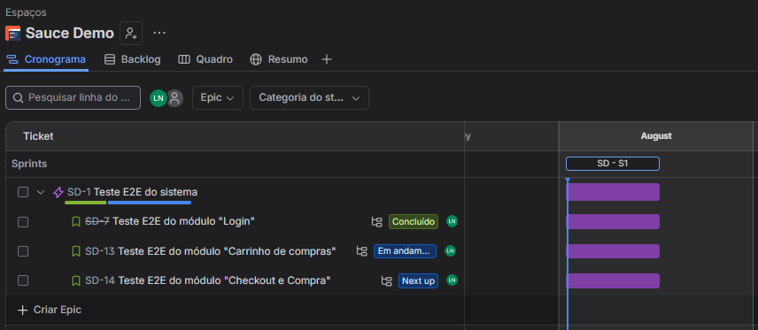
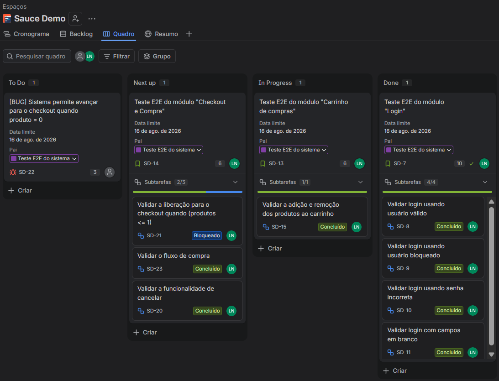

# 🚀 **Testes funcionais integrados com o Jira**

Este projeto contém o planejamento, mapeamento e a execução de testes funcionais (caixa-preta) para a plataforma gratuita SauceDemo. O objetivo é validar o fluxo de ponta a ponta (E2E) e as regras de negócio de um e-commerce fictício, garantindo a qualidade e a gestão de defeitos através do gerenciamento ágil com Jira Software.

## 🛠️ Tecnologias e Ferramentas utilizadas
* **Jira Software:** Ferramenta principal para estruturação de Épicos, User Stories, Sub-tarefas (Casos de Teste) e Bug Reports.
* **SauceDemo (Swag Labs):** Aplicação web alvo utilizada para a execução dos testes funcionais.
* **Metodologia Ágil:** Organização do fluxo de trabalho via Sprint, acompanhamento por quadro Kanban e controle de tarefas bloqueadas.

## 🧪 Fluxo de testes implementado
O projeto cobre os seguintes cenários críticos de negócio:

* **Autenticação:** Validação de login com sucesso, tratamento de tentativa de acesso com usuário bloqueado e validação de campos obrigatórios.
* **Gerenciamento do Carrinho:** Adição e remoção dinâmica de produtos via vitrine e tela do carrinho, garantindo a atualização do contador.
* **Checkout e Compra (E2E):** Preenchimento dos dados do comprador, validação de campos obrigatórios, revisão e confirmação final do pedido.
* **Gestão de Defeitos (Bug Report):** Identificação e documentação de falha crítica na regra de negócio.

## 📁 Estrutura do projeto

Todos os detalhes do que foi feito dentro das sub-tasks e do bug-report estão disponíveis na pasta "Evidencias" do projeto!

Essa foi a arquitetura utilizada dentro do Jira:

